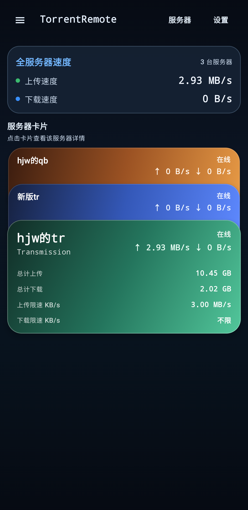

# TorrentRemote

<p align="center">
  <a href="README.zh-CN.md">简体中文</a> | <strong>English</strong>
</p>



TorrentRemote is an Android app for remotely managing qBittorrent and Transmission.

## Highlights

- Connect via host/IP or full `http(s)://` URL
- Save and switch between multiple servers (qBittorrent + Transmission)
- Home server card stack with quick server entry
- Dashboard stats for speeds, totals, and status counts
- Search and sort torrents, with detail tabs and actions
- Add torrents from magnet links, URLs, or `.torrent` files
- Light/dark theme and Chinese/English UI

## Project Info

- App name: `TorrentRemote`
- Application ID: `com.hjw.qbremote`
- Version: `0.1.8` (`versionCode = 8`)
- Min SDK: `26`
- Target / Compile SDK: `35`

## Download

- Latest APK: `torrentremote 0.1.8.apk`
- Release page: https://github.com/smhjw/qbitremote/releases/tag/v0.1.8

## Build (Using Local Toolchain in `tools/`)

This project can be built with the bundled toolchain under:

- `tools/android-build/tools/jdk17`
- `tools/android-build/tools/android-sdk`

PowerShell example:

```powershell
$env:JAVA_HOME="D:\hjw\codex\qb-remote-android\tools\android-build\tools\jdk17"
$env:ANDROID_HOME="D:\hjw\codex\qb-remote-android\tools\android-build\tools\android-sdk"
$env:ANDROID_SDK_ROOT=$env:ANDROID_HOME
$env:PATH="$env:JAVA_HOME\bin;$env:ANDROID_HOME\platform-tools;$env:PATH"

.\gradlew.bat assembleDebug
```

APK output:

- `app/build/outputs/apk/debug/app-debug.apk`

Release AAB for Google Play:

1. Copy `keystore.properties.example` to `keystore.properties` and fill your signing values.
2. Set `RELEASE_KEY_SHA256` to your upload key certificate fingerprint (recommended).
3. Build:

```powershell
.\gradlew.bat bundleRelease
```

Output:

- `app/build/outputs/bundle/release/app-release.aab`

Quick script:

```powershell
.\scripts\build-release-aab.ps1
```

## Google Play Docs

- [Google Play Release Checklist (zh-CN)](docs/google-play/PLAY_RELEASE_CHECKLIST.zh-CN.md)
- [Data Safety Guide (zh-CN)](docs/google-play/DATA_SAFETY_GUIDE.zh-CN.md)
- [Privacy Policy (EN)](docs/google-play/PRIVACY_POLICY.md)
- [Privacy Policy (zh-CN)](docs/google-play/PRIVACY_POLICY.zh-CN.md)
